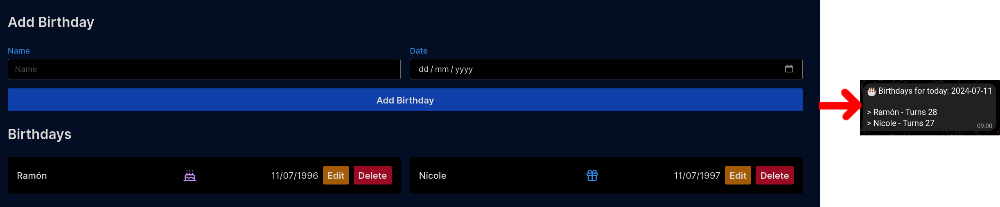

# hbd

HBD is a simple application that serves birthday reminders through telegram.



## Usage

The application usage is very straightforward:

1. Sign up for an account
    + Requires an email, password, reminder time, timezone, [telegram bot API key](#bot-api-key), and [telegram chat ID](#chat-id)
2. Add birthdays
3. Receive reminders

## Self-hosting

### Docker

The application is containerized using docker, we use sqlite as the database by default, but intend to support postgres in the future.

#### Docker compose

The repo includes two docker-compose files. Feel free to customize them to your needs.

1. `docker-compose.yml` - This file is used to run the application locally. It uses an nginx reverse proxy which forwards requests to the application. This is the docker compose file we recommend for personal use unless you want to expose the application to the internet.

```yaml
---
services:
  hbd:
    build:
      context: .
      dockerfile: local.Dockerfile
    container_name: hbd
    volumes:
      - ./data:/app/data
    ports:
      - "8418:80"
    environment:
      - DB_TYPE=sqlite
      - DATABASE_URL=/app/data/hbd.db
      - MASTER_KEY=60bcb71e67cf8e6b71b30af99828974726585c625397f69ccdc587e2f79cf8de
      - PORT=8418
      - ENVIRONMENT=development
      - CUSTOM_DOMAIN=https://hbd.lotiguere.com
      - GIN_MODE=debug
```

2. `docker-compose.prod.yml` - This file is used to run the application in a production environment. We use traefik as a reverse proxy. We can optionally map ports to a local machine but it is not necessary, we opted not to. A `.env.template` file is included in the repo, you can copy it to `.env` and fill in the necessary values, in this case just the `HBD_MASTER_KEY`. The `HBD_MASTER_KEY` is used to encrypt the user's data. 

```yaml
---
services:
  hbd:
    build:
      context: .
      dockerfile: prod.Dockerfile
    container_name: hbd
    volumes:
      - ./data:/app/data
    restart: always
    environment:
      - DB_TYPE=sqlite
      - DATABASE_URL=/app/data/hbd.db
      - MASTER_KEY=${HBD_MASTER_KEY}
      - PORT=8418
      - ENVIRONMENT=production
      - CUSTOM_DOMAIN=https://hbd.lotiguere.com
      - GIN_MODE=release
    labels:
      # Frontend
      - "traefik.enable=true"
      - "traefik.http.routers.hbd.rule=Host(`hbd.lotiguere.com`)"
      - "traefik.http.routers.hbd.entrypoints=websecure"
      - "traefik.http.routers.hbd.tls.certresolver=myresolver"
      - "traefik.http.routers.hbd.service=hbd-service"
      - "traefik.http.services.hbd-service.loadbalancer.server.port=8418"

      # Backend
      - "traefik.http.routers.hbd-api.rule=Host(`hbd.lotiguere.com`) && PathPrefix(`/api`)"
      - "traefik.http.routers.hbd-api.entrypoints=websecure"
      - "traefik.http.routers.hbd-api.tls.certresolver=myresolver"
      - "traefik.http.routers.hbd-api.service=hbd-api-service"
      - "traefik.http.services.hbd-api-service.loadbalancer.server.port=8417"
    networks:
      - proxy

networks:
  proxy:
    name: proxy
    external: true
```

## Contributing

We accept PRs and issues. Feel free to contribute.

## Local development

### Backend

The backend uses Gin as the web framework. We use the `air` tool to reload the server on file changes.

```bash
go get -u github.com/cosmtrek/air
```

### Frontend

The frontend uses nextjs/react. We use `npm` or `pnpm`to manage the frontend dependencies.

```bash
npm install
```

Or:

```bash
pnpm install
```

We use tailwindcss for styling. To run the watcher:
  
```bash
npm run watch
```

### Database

The application uses sqlite, but we intend to also support postgres. We use the `migrate` tool to manage the database migrations.

```bash
go get -u github.com/mattn/go-sqlite3
go get -u github.com/golang-migrate/migrate/v4/cmd/migrate
```

To run the migrations:

```bash
migrate -database 'sqlite3://hbd.db' -path ./migrations up
```

### ORM

We use `sqlboiler` to generate the ORM models.

```bash
go get -u github.com/volatiletech/sqlboiler/v4
```

To generate the models:

```bash
sqlboiler psql --config .sqlboiler.toml
```

### Swagger

We use `swag` to generate the swagger docs.

```bash
go get -u github.com/swaggo/swag/cmd/swag
```

To generate the docs:

```bash
swag init
```

## Telegram-related stuff

### Getting a bot API key and chat ID

#### Bot API key

1. Open Telegram
2. Search for `BotFather`
3. Start a chat with `BotFather`
4. Use the `/newbot` command to create a new bot
5. Follow the instructions to create a new bot
6. Copy the API key

Through this API key the application can send messages to you through the bot.

#### Chat ID

1. Open Telegram on your mobile device
2. Send `/start` to your newly created bot
3. Send a message to the bot
4. Open the following URL in your browser: `https://api.telegram.org/bot<API_KEY>/getUpdates`
5. Look for the `chat` object in the JSON response
6. Copy the `id` field

Using this ID the application can send messages to your chat specifically.
